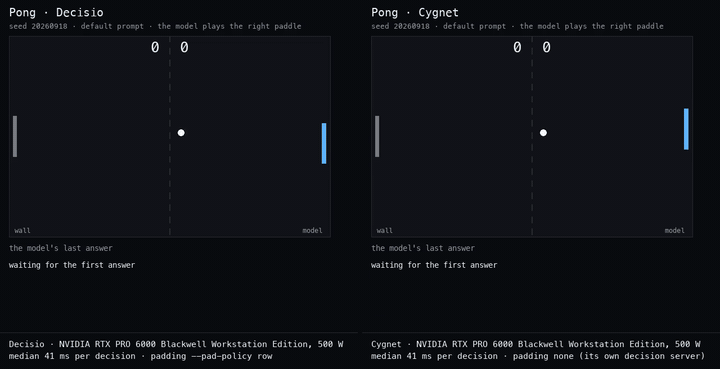
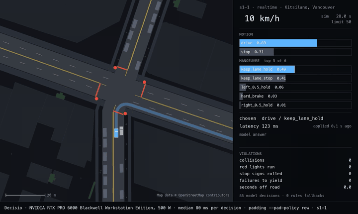
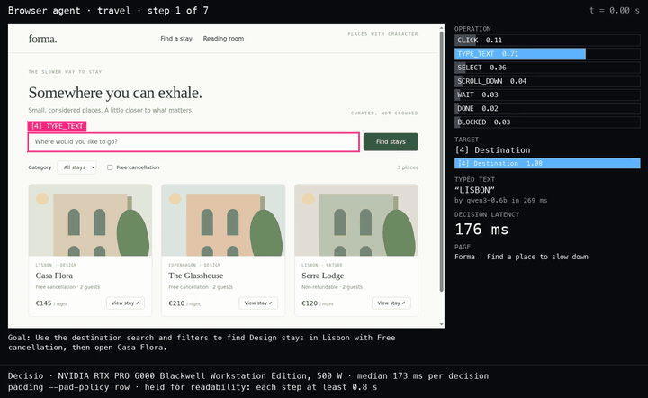
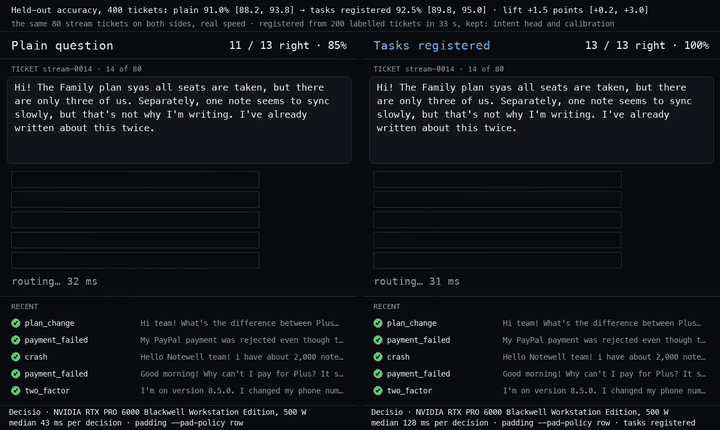

<!-- SPDX-License-Identifier: Apache-2.0 -->
<!-- SPDX-FileCopyrightText: Copyright contributors to the decisio project -->

# Four demos, judged decision by decision

Decisio served the demos in `examples/demos/` (Pong, a driving simulator, a browser agent, and a support-ticket triage feed), and every decision it made was checked against an oracle.
Cygnet and four hosted models played the same games on the same seeds for comparison.
This page has the results, the error analysis behind them, the renderings that were tested on held-out data, and what teaching (task registration) did.

The decisio server ran its served defaults from main at 62dfe1f with `--pad-policy row`, on one NVIDIA RTX PRO 6000 Blackwell Workstation Edition (500 W), with the demo client on the same machine.
`--pad-policy row` is stated under every clip and table.
The measurements were taken on 2026-10-03.

## Watch it play

Every clip is rendered from a recorded trajectory (`examples/demos/tools/trajectory.py`), at the speed the run happened.
Nothing in a clip is re-simulated or re-driven; the caption under it names the model, the card, the median latency of that run and the padding.

| demo | clip |
| --- | --- |
| Pong, Decisio and Cygnet on the same serve (seed 20260918) | [MP4](media/pong_decisio_cygnet.mp4) ·  |
| Driving, Decisio, one drive in real time (scenario s1-1) | [MP4](media/driving_decisio_s1-1.mp4) ·  |
| Driving, Decisio and Cygnet side by side on the same drive | [MP4](media/driving_decisio_cygnet_s1-1.mp4) |
| Browser agent, Decisio on the travel task | [MP4](media/browser_decisio_travel.mp4) ·  |
| Browser agent, Decisio and Cygnet on the travel task | [MP4](media/browser_decisio_cygnet_travel.mp4) |
| Browser agent, Decisio in the reading room | [MP4](media/browser_decisio_reading.mp4) |
| Triage, the same tickets before and after registering 200 labelled tickets | [MP4](media/triage_plain_vs_taught.mp4) ·  |

The browser clips hold each step for at least 0.8 s so it can be read; their captions say so.
The driving clips draw map data from OpenStreetMap (© OpenStreetMap contributors, ODbL).
Clips are shown for Decisio and Cygnet only: a clip shows every decision's answer, and the hosted models' answers are reported here as aggregates.

## How each decision is judged

| demo | the oracle | what it is not |
| --- | --- | --- |
| Pong | a perfect-information paddle: the true ball's crossing of the paddle's plane after wall bounces, and a move toward it, staying inside half a step (6 units) | while the ball moves away there is nothing to judge; those decisions are counted apart |
| driving | the demo's own rules driver on the same snapshot and the same candidates: the motion (drive or stop) and the manoeuvre | a good driver, not a perfect one; the drive's own score (arrive with no collision, red light, rolled stop sign, failure to yield or a second off the road) is reported beside it |
| browser agent | the set of actions a careful user could take at each step of two fixture tasks; 272 labelled steps from three places | a label for the operation and the target on two small fixtures |
| triage | the ticket's true queue | synthetic, templated tickets |

A disagreement is classed, in this order:

1. **Latency effect**: the right decision arrived too late (driving only: the answer equals the oracle on the snapshot it was asked about but not when it was applied, or the demo's 1.5 s timeout replaced it).
2. **Prompt or state effect**: a written detector per demo, defined before any fix was tested: the model followed the question's own wording where it differs from the oracle (Pong's 5-unit band against the game's 6; the driving state's "at" a light up to 6 m before the line, where the rules driver stops within 1.5 m, counted "as worded" and not as an error), or the state lacked what the decision needs (the browser agent: DONE while a typed search is still unsubmitted).
3. **Near-tie**: the chosen option's probability minus the oracle option's is below 0.10.
4. **Judgement error**: anything else; reported, not tuned away.

The hosted models answer with one option, not a distribution, so their misses cannot be split into near-tie and judgement.

## Results

Decisio and Cygnet ran on the card; the hosted models ran from a Mac on the same seeds and renderings.
Driving compares every player on the same three drives (suite seed 1, scenarios 1 to 3); the card players also drove more, given below each table.
Intervals are 95% bootstrap intervals over games or drives; latency is the client's round trip, p50 / p95, in ms.

### The players

| row | model ID | date | route | serving provider |
| --- | --- | --- | --- | --- |
| Decisio | Qwen/Qwen3.6-35B-A3B-FP8 served by decisio (main 62dfe1f, served defaults, `--pad-policy row`) | 2026-10-03 | local server on the card | |
| Cygnet | google/gemma-4-12B-it @707f0a3b with the cygnet-recipe decision server @3cf591c6 (T 3.4) | 2026-10-03 | local server on the card | |
| Jev 1.13 through its public API | jev-1.13.0 | 2026-10-03 | TypeSafe public API | TypeSafe |
| google/gemini-3.8-flash | google/gemini-3.8-flash | 2026-10-03 | OpenRouter | Google AI Studio |
| anthropic/claude-haiku-4.5 | anthropic/claude-haiku-4.5 | 2026-10-03 | OpenRouter | Anthropic |
| openai/gpt-6-luna | openai/gpt-6-luna | 2026-10-03 | OpenRouter | OpenAI |

The hosted models' latencies include the network from the Mac; OpenRouter's own added time was measured at 130 to 155 ms per call.

### Browser agent (10 runs of each task)

| player | travel completed | travel decisions right | reading room completed | reading room decisions right | latency p50 / p95 |
| --- | --- | --- | --- | --- | --- |
| Decisio | 10/10 | 50/70 | 10/10 | 80/140 | 140 / 173 |
| Cygnet | 10/10 | 60/60 | 10/10 | 20/20 | 58 / 253 |
| Jev 1.13 through its public API | 10/10 | 60/60 | 10/10 | 20/20 | 130 / 185 |
| google/gemini-3.8-flash | 10/10 | 60/60 | 10/10 | 20/20 | 1308 / 2030 |
| anthropic/claude-haiku-4.5 | 10/10 | 40/50 | 10/10 | 20/20 | 1248 / 1767 |
| openai/gpt-6-luna | 10/10 | 60/68 | 10/10 | 20/20 | 2878 / 4464 |

On the 272 labelled steps (the operation question alone), Decisio's answer is inside the acceptable set on 243 (89%) and Cygnet's on 268 (99%).

### Driving

| player | lockstep: drives passed | lockstep: motion errors / motion answers | realtime: drives passed | realtime: motion errors / latency effects | decisions per second (lockstep, realtime) | latency p50 / p95 (lockstep) |
| --- | --- | --- | --- | --- | --- | --- |
| Decisio | 3 of 3 | 8 / 545 | 3 of 3 | 8 / 2 | 8.48, 3.20 | 104 / 150 |
| Cygnet | 3 of 3 | 0 / 574 | 3 of 3 | 0 / 7 | 2.49, 2.30 | 371 / 693 |
| Jev 1.13 through its public API | 3 of 3 | 0 / 711 | 3 of 3 | 0 / 2 | 6.58, 3.03 | 126 / 178 |
| google/gemini-3.8-flash | 3 of 3 | 0 / 564 | 1 of 3 | 1 / 98 | 0.59, 0.40 | 1319 / 3853 |
| anthropic/claude-haiku-4.5 | 3 of 3 | 0 / 609 | 3 of 3 | 0 / 12 | 0.89, 0.96 | 1026 / 1574 |
| openai/gpt-6-luna | 3 of 3 | 0 / 848 | 1 of 3 | 0 / 109 | 0.30, 0.08 | 3195 / 5911 |

Lockstep waits for every decision, so it measures the decisions alone; realtime keeps the car moving while a request is in flight, as the demo does, so a slow answer arrives too late.
Gemini and Luna lose drives in realtime to latency, not to judgement: about a second per decision, and the demo's 1.5 s timeout hands most of Luna's decisions to the rules driver.
Over all of its drives, Decisio passed 16 of 18 in lockstep (one collision in s2-4, one drive off the road in s2-5; the rules driver alone passes both) and 9 of 9 in realtime; Cygnet passed 6 of 6 in lockstep and 9 of 9 in realtime.

### Pong (5 games of up to 45 s, seeds 20260917 to 20260921)

| player | agrees with the oracle while the ball approaches | decisions on approach | decisions per second | latency p50 / p95 | returns per game |
| --- | --- | --- | --- | --- | --- |
| Decisio | 60% [53, 65] | 531 | 24.6 | 41 / 42 | 22.8 [12.4, 32.8] |
| Cygnet | 47% [41, 53] | 459 | 22.9 | 41 / 69 | 19.2 [12.8, 26.4] |
| Jev 1.13 through its public API | 96% [94, 98] | 913 | 8.2 | 116 / 166 | 45.8 [45.4, 46.0] |
| google/gemini-3.8-flash | 98% [94, 100] | 95 | 0.87 | 1131 / 1570 | 5.0 |
| anthropic/claude-haiku-4.5 | 69% [55, 86] | 139 | 1.29 | 745 / 1000 | 6.8 [6.4, 7.0] |
| openai/gpt-6-luna | 98% [95, 100] | 58 | 0.62 | 1460 / 2724 | 3.4 [3.0, 3.8] |

A game ends when the model's paddle misses five times; the ball advances one step per decision, so returns per game reward fast answers as much as right ones.

### Triage (Decisio, 400 held-out tickets over 20 queues)

| | plain question | after registering 200 labelled tickets |
| --- | --- | --- |
| accuracy | 91.0% [88.2, 93.8] | 92.5% [89.8, 95.0] |
| paired difference | | +1.5 points [+0.2, +3.0]; 7 answers fixed, 1 broken |
| macro-F1 | 0.912 | 0.926 |
| latency p50 / p95 | 40 / 41 | 124 / 129 |

Registration took 33 s and kept both the intent head and the calibration (each kept only when cross-validation on the examples shows a gain).
The head costs latency: a registered answer reads the model's hidden state as well as its letters.
The plain question is already right on 91% of these synthetic tickets, so the lift is small.

## Decisio's errors

| demo | decisions judged | agree | latency | prompt or state | near-tie | judgement | what the errors are |
| --- | --- | --- | --- | --- | --- | --- | --- |
| Pong, ball approaching | 531 | 330 | 0 by construction | 12 | 63 | 126 | mostly "stay" with the ball about 30 units below the paddle; 21 of the misses turned a return into a lost point |
| driving lockstep, motion (18 drives) | 4,173 | 2,934 + 1,207 as worded | 0 | | 13 | 19 | 30 of 32 a stop where the rules driver goes |
| driving realtime, motion (9 drives) | 1,927 | 1,102 + 809 as worded | 5 | | 3 | 8 | all 11 a stop where the rules driver goes |
| browser, labelled steps | 272 | 243 | 0 by construction | 5 | 4 | 20 | DONE before the search is applied; a click on the wrong control |

In the live browser runs, Decisio completes both tasks every time but not by the shortest path.
On the travel task it re-selects the category once and opens Casa Flora before submitting the typed destination; the fixture's own check does not test the search, so the run counts as completed and the oracle counts both steps as misses.
In the reading room it opens the article and then clicks back to the list about six times (its probability for DONE on the article is 0.27 to 0.42) before DONE wins.

## Renderings tested on held-out data

A change to a demo's state or question is kept only when its gain on held-out seeds or places is clear of zero (the paired 95% interval excludes it) and it adds observations only: no verdict, no recommendation, no score per option.

| demo | change | held-out data | result | kept |
| --- | --- | --- | --- | --- |
| Pong | the arrival in words ("the ball will arrive 14.2 units above the centre of your paddle") instead of coordinates, and the moves defined ("move the paddle 12 units toward the top of the screen") | seeds 40000 to 40009 | -32.3 points [-40.8, -23.9]: Decisio answers "stay" almost always | no |
| Pong | `offset`, the intercept minus the paddle's position, added to the state | the same | +4.9 points [-4.9, +15.3] | no |
| Pong | the stay band worded as the game's 6 units | the same | -1.9 points [-11.4, +9.8] | no |
| driving | after a completed stop, once the car is past the line, the state says "the car is already in the junction, N m past the stop line" instead of telling it to hold for cross traffic | suite seeds 201 to 203, 18 drives, lockstep | motion errors 101 to 59, -2.33 per drive [-5.17, -0.44]; drives passed 14 of 18 both | yes |
| browser agent | a typed field marked submitted or not (from the page's own submit events), filters marked applied, and a shorter action history | the 272 labelled steps of three places, and 10 + 10 live runs | all steps -3.3 points [-7.4, +0.7] (Casa Flora +0.8, the Glasshouse -8.3 [-15.0, -1.7]); the reading room then loops to the step limit in 10 of 10 runs | no |
| browser agent | DONE's description adds that an unsubmitted search is not applied | the labelled steps of the two places it was not designed on (it came from a Casa Flora step) | the Glasshouse and Serra Lodge 88% to 86% and 91% to 88%; Casa Flora itself +5.0 points [+0.8, +10.0]; all 272 steps +0.7 [-2.9, +4.0] | no |

The driving change fixes a sentence that contradicted the state it sits in: the default text tells the car to hold for cross traffic even when the car is already in the junction, where the rules driver goes on.
The final runs above use it; Pong and the browser agent use their default renderings.

## Pong's limit

With the default prompt the Pong question asks the model to compare two numbers, the intercept and the paddle's position, and choose a direction.
Decisio agrees with the perfect paddle on 60% of decisions while the ball approaches, on the evaluated seeds and on held-out seeds alike; given the signed distance it reaches 66% and reads the sign backwards on most of what remains, and given the relationship in words it stops moving.
This is recorded as a limit of the model on numeric comparison, not of the prompt.
The same question is answered at 96% by Jev 1.13 through its public API in about 120 ms per decision, and at 98% by Gemini 3.8 Flash and GPT 6 Luna in 1.1 to 1.5 s.

## Teaching

In the games, registering the questions with fixed option lists (Pong's move, the driving motion, the browser operation) from oracle-labelled examples on seeds disjoint from the evaluated ones gave no gain.
The server declined the Pong and driving calibrations because cross-validation on their examples showed none, so those questions were answered exactly as before.
It kept the browser operation's calibration, which moved probability toward the options the examples used most and scored -1.8 points [-4.4, +0.4] on the labelled steps, with the live runs unchanged; seven per-option biases cannot make a correction that depends on the page.
The driving manoeuvre and the browser's element target cannot be registered: their options change every step.
On triage, a fixed 20-queue question, registration from 10 labelled tickets per queue lifted held-out accuracy by 1.5 points [+0.2, +3.0], from an already high 91.0%.

## Reproducing

`examples/demos/README.md` lists the commands: each `tools/measure_*.py` writes a run record with trajectories, and each `tools/render_*.py` draws a clip from them.
The hosted models were reached through `examples/demos/tools/systemone_gateway.py`, which renders a System One request as a chat request with a structured answer; the OpenRouter calls pinned the first-party provider, disallowed fallbacks and denied data collection.
